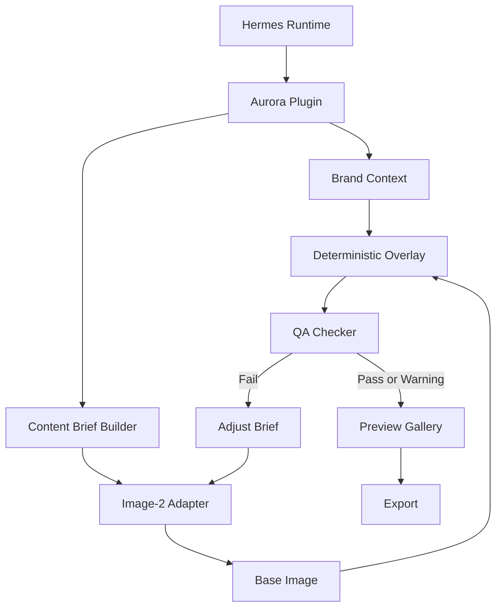

# Aurora OS Hermes-first MVP PRD

版本：v0.1  
日期：2026-05-12  
模式：Scope Reduction  
宿主优先级：Hermes first，OpenClaw later

---

## 1. 产品定义

Aurora OS v1 是一个运行在 Hermes 上的品牌内容生成插件。

它面向中小品牌企业，基于品牌资产、产品图、内容意图和基础规则，调用 Image-2 生成单张或多张品牌内容图，并通过确定性 Overlay 与 QA 校验，输出可预览、可导出的品牌内容素材。

一句话定义：

> Hermes-first 品牌内容生成插件：输入品牌资产与内容意图，调用 Image-2 生成品牌内容图，经过确定性嵌入与 QA 后交付可用素材。

---

## 2. ICP 与用户

### 2.1 ICP

中小品牌企业，尤其是每天需要稳定产出社媒、活动、电商或品牌宣传内容，但没有完整设计与内容运营团队的公司。

### 2.2 主要用户

- 品牌创始人 / 经营者
- 市场负责人
- 内容运营人员
- 服务多个中小品牌的代理商操盘手

### 2.3 用户痛点

- 每天都需要内容，但人工生产慢且不稳定
- AI 生成图容易改错 logo、产品图、品牌色和文案
- 普通 AI 工具无法保证品牌一致性
- 发布前缺少自动质检，人工检查成本高
- 多张图内容风格容易漂移

---

## 3. MVP 目标

### 3.1 核心目标

- 在 Hermes 中以插件形式运行 Aurora
- 支持输入品牌上下文与产品资产
- 支持调用 Image-2 生成单张品牌内容图
- 支持一次生成多张品牌内容图
- 使用确定性 Overlay 固定嵌入 logo 与产品图
- 使用 QA Checker 校验基础品牌合规性、品牌调性、视觉风格与历史偏好
- QA 不通过时自动调整 brief 并重新生成，直到通过或达到人工介入条件
- 提供结果预览与导出

### 3.2 非目标

v1 不做：

- 真实发布到小红书、微信、抖音、LinkedIn
- 自动排期与发布管理
- 完整营销日历系统
- OpenClaw 原生插件实现
- A/B 自动回流优化
- 爆款评分引擎
- 多品牌企业后台
- 模板市场
- 手动设计编辑器
- 通用聊天机器人

---

## 4. 成功指标

### 4.1 功能成功指标

- 单图生成链路成功率 >= 95%
- 多图批量生成链路成功率 >= 90%
- QA 能识别缺失 logo / 缺失产品图 / 尺寸错误 / 禁用词命中 / 品牌调性偏离 / 视觉风格偏离 / 品牌偏好冲突
- QA 不通过时，系统能基于失败原因自动调整 brief 并重新生成
- 用户可以在 Hermes 中完成生成、预览、导出闭环

### 4.2 体验成功指标

- 单张图从提交到预览完成 <= 2 分钟
- 4 张图批量生成 <= 6 分钟
- QA 失败时用户能看到明确失败原因
- 用户无需理解 Image-2 prompt 细节即可生成内容

---

## 5. 产品范围

### 5.1 v1 范围



### 5.2 核心链路

1. 用户在 Hermes 中打开 Aurora 插件。
2. 用户选择或输入品牌资料。
3. 用户上传 logo 与产品图。
4. 用户输入本次内容意图，例如新品、促销、节日、产品卖点。
5. 用户选择生成数量：1 张或多张。
6. Aurora 构建结构化 brief。
7. Image-2 生成基础图片。
8. Overlay 系统固定嵌入 logo 与产品图。
9. QA Checker 执行品牌合规、调性、风格与偏好校验。
10. 如果 QA 不通过，Aurora 根据失败原因调整 brief，重新调用 Image-2 生成。
11. 当结果通过 QA 或达到人工介入条件时，用户在 Gallery 中查看结果。
12. 用户导出通过 QA 的素材。

---

## 6. 功能需求

### 6.1 Hermes Plugin Entry

Aurora v1 必须作为 Hermes 插件运行。

插件入口：

```ts
runAuroraImagePipeline(input: AuroraImagePipelineInput): Promise<AuroraImagePipelineResult>
```

输入包括：

- `brand_id`
- `campaign_name`
- `content_intent`
- `generation_count`
- `channel_format`
- `brand_context`
- `logo_asset`
- `product_assets`

输出包括：

- `job_id`
- `status`
- `generated_items`
- `qa_summary`
- `export_files`

### 6.2 Brand Context

Brand Context 保存品牌生成所需的最小上下文。

```json
{
  "brand_id": "brand_001",
  "brand_name": "Aurora Sample Brand",
  "tone": "premium",
  "brand_colors": ["#111111", "#FFFFFF"],
  "avoid_words": ["夸大词", "违规词"],
  "must_include": ["产品名"],
  "visual_style": "minimal",
  "tone_rules": {
    "voice": "professional",
    "emotion": "calm",
    "formality": "medium",
    "must_feel_like": ["可信", "高级", "清晰"],
    "must_not_feel_like": ["廉价", "夸张", "杂乱"]
  },
  "style_preferences": {
    "preferred_composition": ["留白", "产品居中", "弱背景"],
    "preferred_lighting": "soft studio lighting",
    "preferred_texture": "clean matte",
    "avoid_styles": ["强赛博朋克", "过度卡通", "低价促销风"]
  },
  "historical_preferences": {
    "approved_examples": ["asset://approved_001.png"],
    "rejected_examples": ["asset://rejected_001.png"],
    "notes": ["偏好简洁海报，不要过多装饰元素"]
  },
  "logo_rules": {
    "position": "bottom_right",
    "safe_margin_px": 48,
    "min_width_px": 120
  },
  "product_rules": {
    "position": "center",
    "max_area_ratio": 0.45
  }
}
```

MVP 只要求支持单品牌上下文，不要求多品牌后台管理。

### 6.3 Asset Input

用户必须能提供：

- logo 文件
- 一个或多个产品图
- 可选参考图

资产要求：

- 支持 PNG / JPG / WEBP
- logo 推荐透明 PNG
- 产品图推荐透明 PNG 或白底图
- 上传失败时必须返回明确错误

### 6.4 Content Brief Builder

Brief Builder 把用户输入转成 Image-2 可用的结构化生成 brief。

输入：

- 品牌上下文
- 品牌调性、风格与历史偏好
- 内容意图
- 产品卖点
- 目标渠道尺寸
- 生成数量

输出：

```json
{
  "brief_id": "brief_001",
  "channel_format": "xiaohongshu_post",
  "size": {
    "width": 1242,
    "height": 1660
  },
  "image_direction": "minimal product poster",
  "copy_direction": "highlight one product benefit",
  "brand_tone_constraints": [
    "professional but approachable",
    "premium, calm, not exaggerated"
  ],
  "style_constraints": [
    "minimal composition",
    "clean product focus",
    "avoid cluttered promotional design"
  ],
  "preference_memory": {
    "use_approved_examples_as_reference": true,
    "avoid_rejected_example_patterns": true
  },
  "negative_constraints": [
    "do not alter logo",
    "do not invent product packaging",
    "avoid cluttered background"
  ],
  "variant_count": 4
}
```

### 6.5 Image-2 Adapter

Image-2 Adapter 负责隔离具体图像模型调用。

职责：

- 接收结构化 brief
- 构建 Image-2 请求
- 调用 Image-2
- 返回基础图片
- 记录失败原因

MVP 要求：

- 支持单张生成
- 支持多张生成
- 支持失败重试
- 不把 logo 和产品图最终嵌入交给模型决定

### 6.6 Deterministic Overlay

Overlay 是 v1 的核心品牌安全机制。

职责：

- 按规则把 logo 放到固定区域
- 按规则把产品图放到固定区域
- 保证 logo 不被模型改写
- 保证产品图不被模型重绘
- 输出最终合成图

Overlay 输入：

- Image-2 生成的基础图
- logo asset
- product asset
- overlay rules

Overlay 输出：

- final image
- overlay metadata

```json
{
  "logo_applied": true,
  "logo_position": "bottom_right",
  "product_applied": true,
  "product_position": "center",
  "output_size": {
    "width": 1242,
    "height": 1660
  }
}
```

### 6.7 QA Checker

QA Checker 负责判断最终图片是否可交付。它不仅检查硬性资产规则，也要检查输出是否符合品牌既有调性、视觉风格和历史偏好。

MVP QA 项：

- logo 是否存在
- logo 是否在指定区域
- 产品图是否存在
- 产品图是否在指定区域
- 输出尺寸是否正确
- OCR 文字是否命中禁用词
- OCR 文字是否包含必需词
- 图片是否成功生成并可打开
- 品牌色是否大致符合规则
- 文案语气是否符合 `tone_rules`
- 画面情绪是否符合品牌调性
- 构图、光线、材质是否符合 `style_preferences`
- 是否复用了已拒绝案例的明显风格问题
- 是否接近历史通过案例的风格方向

QA 需要输出可操作的失败原因，供 Regeneration Loop 调整下一轮 brief。

QA 状态：

- `pass`
- `warning`
- `fail`

QA 输出：

```json
{
  "status": "fail",
  "issues": [
    {
      "code": "LOGO_MISSING",
      "severity": "error",
      "message": "未检测到品牌 logo",
      "regeneration_hint": "重新生成后继续使用 deterministic overlay 注入 logo，并在 QA 前验证 overlay metadata"
    }
  ]
}
```

### 6.8 QA-driven Regeneration Loop

当 QA 返回 `fail` 时，Aurora 不应直接结束任务，而应进入重新生成闭环。

闭环规则：

1. 读取 QA issue code。
2. 将失败原因转成 brief adjustment。
3. 保留原始品牌上下文、产品资产和 overlay 规则。
4. 调整 Image-2 brief 中的视觉方向、负面约束、调性约束或风格约束。
5. 重新调用 Image-2。
6. 重新执行 Overlay。
7. 重新执行 QA。
8. 直到 QA 通过、达到最大重试次数，或触发人工介入。

默认最大重试：

- 单张图：最多 3 轮 QA-driven regeneration
- 多张图：每个 item 最多 2 轮 QA-driven regeneration

必须触发人工介入的情况：

- 连续重试后仍然缺失 logo 或产品图
- Image-2 连续返回空结果
- 同一个品牌调性问题连续出现 3 次
- QA 无法判断是否符合品牌偏好
- 用户明确停止生成

Regeneration adjustment 示例：

```json
{
  "source_issue": "STYLE_MISMATCH",
  "previous_attempt": 1,
  "adjustments": {
    "image_direction": "clean premium product poster with more white space",
    "style_constraints": [
      "reduce decorative elements",
      "use softer lighting",
      "keep product as the only visual focus"
    ],
    "negative_constraints": [
      "avoid loud sale poster style",
      "avoid cartoon rendering",
      "avoid cluttered background"
    ]
  }
}
```

### 6.9 Preview Gallery

用户需要在 Hermes 中查看生成结果。

Gallery 必须展示：

- 缩略图
- QA 状态
- 失败 / 警告原因
- 重试次数
- 当前结果是否为自动重生成产物
- 生成时间
- 导出按钮

Gallery 不做复杂设计编辑，只负责查看、筛选和导出。

### 6.10 Export

MVP 支持导出：

- PNG
- JPG
- JSON metadata

导出包建议包含：

- final image
- QA result
- generation brief
- overlay metadata

---

## 7. 数据结构

### 7.1 Pipeline Input

```ts
type AuroraImagePipelineInput = {
  brand_id: string;
  campaign_name?: string;
  content_intent: string;
  generation_count: number;
  channel_format: "square" | "portrait" | "landscape" | "custom";
  brand_context: BrandContext;
  logo_asset: AssetRef;
  product_assets: AssetRef[];
};
```

### 7.2 Pipeline Result

```ts
type AuroraImagePipelineResult = {
  job_id: string;
  status: "running" | "completed" | "partial_failed" | "failed";
  generated_items: GeneratedItem[];
  qa_summary: {
    pass_count: number;
    warning_count: number;
    fail_count: number;
  };
};
```

### 7.3 Generated Item

```ts
type GeneratedItem = {
  item_id: string;
  status: "pass" | "warning" | "fail";
  base_image_url?: string;
  final_image_url?: string;
  qa_result: QAResult;
  brief: ImageBrief;
  overlay_metadata: OverlayMetadata;
};
```

---

## 8. 错误与失败处理

### 8.1 必须命名的错误

- `BRAND_CONTEXT_INVALID`
- `LOGO_ASSET_MISSING`
- `PRODUCT_ASSET_MISSING`
- `IMAGE2_REQUEST_FAILED`
- `IMAGE2_TIMEOUT`
- `IMAGE2_EMPTY_RESULT`
- `OVERLAY_FAILED`
- `QA_CHECK_FAILED`
- `BRAND_TONE_MISMATCH`
- `STYLE_MISMATCH`
- `PREFERENCE_CONFLICT`
- `REGENERATION_LIMIT_REACHED`
- `EXPORT_FAILED`

### 8.2 Retry 规则

- Image-2 请求失败：最多重试 2 次
- Image-2 返回空图：最多重试 1 次
- Overlay 失败：不自动重试，直接 fail
- QA fail：进入 QA-driven Regeneration Loop
- QA-driven regeneration 超过最大次数：停止自动生成，标记为 `REGENERATION_LIMIT_REACHED`，允许用户查看失败结果和失败原因

### 8.3 用户可见反馈

每个失败结果必须展示：

- 失败阶段
- 错误代码
- 简短原因
- 可执行建议
- 已重试次数
- 下一步状态：继续自动重试、等待人工介入、或可导出

---

## 9. 验收标准

### 9.1 单张生成验收

给定：

- 一个有效 Brand Context
- 一个 logo
- 一个产品图
- 一个内容意图

当用户生成 1 张内容图时：

- 系统成功调用 Image-2
- 系统生成基础图
- 系统完成 logo 与产品图 Overlay
- 系统完成 QA
- 如 QA fail，系统根据失败原因调整 brief 并重新生成
- 最终通过 QA，或明确标记为达到自动重试上限
- Gallery 展示最终图与 QA 状态
- 用户可以导出最终图

### 9.2 多张生成验收

给定 `generation_count = 4`：

- 系统生成 4 个 brief variant
- 每个 variant 独立调用或批量调用 Image-2
- 每张图独立执行 Overlay
- 每张图独立执行 QA
- QA fail 的 item 独立进入 regeneration，不阻塞已通过 item
- Gallery 展示 4 张结果
- 允许部分成功，状态为 `partial_failed`

### 9.3 QA 验收

当 logo 缺失时：

- QA 返回 `fail`
- issue code 为 `LOGO_MISSING`

当产品图缺失时：

- QA 返回 `fail`
- issue code 为 `PRODUCT_MISSING`

当禁用词出现时：

- QA 返回 `fail` 或 `warning`
- issue code 为 `FORBIDDEN_WORD_DETECTED`

当尺寸不匹配时：

- QA 返回 `fail`
- issue code 为 `SIZE_MISMATCH`

当品牌调性明显偏离时：

- QA 返回 `fail`
- issue code 为 `BRAND_TONE_MISMATCH`
- 系统调整 tone constraints 后重新生成

当视觉风格明显偏离历史偏好时：

- QA 返回 `fail`
- issue code 为 `STYLE_MISMATCH`
- 系统调整 style constraints 和 negative constraints 后重新生成

当输出接近历史拒绝案例的问题模式时：

- QA 返回 `fail` 或 `warning`
- issue code 为 `PREFERENCE_CONFLICT`
- 系统降低相似风格权重并重新生成

---

## 10. 后续周期

### Cycle 2：A/B 与反馈记录

- 保存内容 variant
- 记录人工选择结果
- 支持人工录入平台表现
- 统计不同风格和 brief 的表现

### Cycle 3：自动优化

- 增加内容评分
- 根据历史表现优化 brief
- 增加半自动策略推荐

### Cycle 4：发布与多平台

- 增加发布接口
- 增加排期
- 增加平台状态回写

### Cycle 5：OpenClaw 支持

- 抽象 runtime contract
- 增加 OpenClaw adapter
- 保持核心 pipeline 不变

---

## 11. 当前推荐实现顺序

1. 定义 Hermes plugin entry contract
2. 定义 Brand Context schema
3. 实现 Image-2 Adapter
4. 实现单图 pipeline
5. 实现 Overlay
6. 实现基础 QA
7. 实现品牌调性、视觉风格与偏好 QA
8. 实现 QA-driven Regeneration Loop
9. 实现 Preview Gallery
10. 实现多图 pipeline
11. 实现导出
12. 补充错误、重试和 metadata

---

## 12. CEO Review Summary

Mode: SCOPE REDUCTION

Accepted scope:

- Hermes-first plugin
- Image-2 brand content generation
- Single and multi-image generation
- Deterministic logo/product overlay
- Basic QA
- Brand tone, style and preference QA
- QA-driven regeneration until pass or explicit intervention threshold
- Preview and export

Deferred:

- Publishing
- A/B feedback loop
- Viral scoring
- OpenClaw native support
- Enterprise multi-brand backend

Recommended path:

Build the narrowest useful Hermes plugin that proves the core promise: small and medium brands can reliably generate brand-aligned content images with Image-2.
